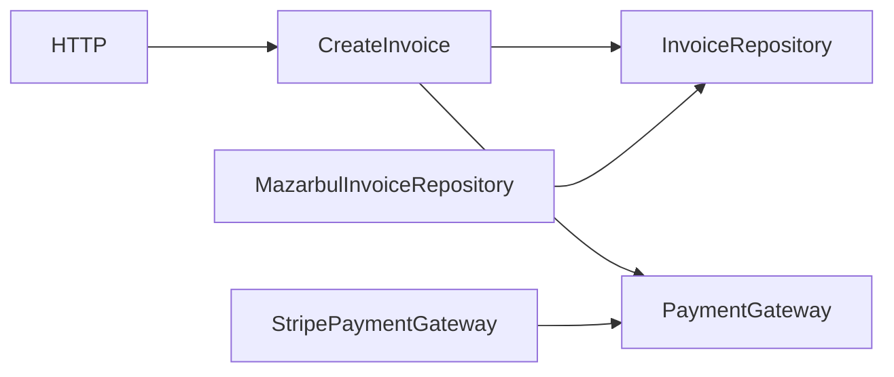

# Durin’s Forge — Product, DX & Tooling Master Specification

**Status:** Master specification / source for derived implementation specs  
**Repository:** `EreborCodeForge/durins-forge`  
**Scope:** Framework DX, CLI, architecture presets, runtime operations, diagnostics, dependency graph, documentation and version normalization  
**Audience:** implementation agents, maintainers and reviewers  
**Design principle:** simple by default, structured when needed, distributed when justified  
**Primary runtime:** MithrilPHP + Eregion  
**Baseline PHP:** PHP 8.5+ (`^8.5`)  
**Document role:** this is NOT a single implementation task. It is the parent specification from which smaller, independently implementable specs MUST be derived.

---

# 1. Purpose

Durin’s Forge must evolve from a framework skeleton with compilation/runtime integration into a cohesive developer experience for building:

- small APIs;
- internal services;
- backend services;
- modular monoliths;
- microservices;
- worker-oriented applications.

The framework must preserve a small core and avoid turning into a collection of unrelated generators.

The primary objective is:

> Make the simple path extremely simple while preserving architectural boundaries that allow the application to grow without a framework rewrite.

Durin must provide tooling that understands:

- application structure;
- architectural boundaries;
- dependency direction;
- runtime state;
- framework/runtime compatibility;
- generated artifacts;
- operational health.

Durin must NOT attempt to replace:

- Eregion as the production application server;
- MithrilPHP as the worker/runtime engine;
- Composer;
- Docker/Kubernetes;
- external observability platforms;
- full static-analysis tools where an existing standard tool already solves the problem.

---

# 2. Product principles

All implementation decisions must be evaluated against these principles.

## 2.1 Simplicity first

Default commands must generate the minimum useful structure.

Do not create empty directories or abstractions merely because a theoretical architecture contains them.

Example:

```text
BAD

src/
  Domain/
    Entity/
    ValueObject/
    Event/
    Service/
    Repository/
  Application/
    DTO/
    Command/
    Query/
    Handler/
    UseCase/
```

when the application currently contains one endpoint.

Prefer:

```text
src/
  Application/
  Http/
```

and grow structure only when required.

---

## 2.2 Progressive architecture

Durin must allow an application to evolve approximately through:

```text
minimal API
    ↓
service
    ↓
modular application
    ↓
modular monolith
    ↓
extracted microservice
```

A developer must not need to abandon the framework when moving between these stages.

---

## 2.3 Explicit over magic

Generated code and runtime configuration must remain inspectable.

Avoid hidden runtime conventions that cannot be explained by:

```bash
durin doctor
durin status
durin graph:dependencies
```

If Durin creates or infers something important, Durin should be able to explain it.

---

## 2.4 Runtime boundaries remain strict

Canonical responsibility model:

```text
Durin's Forge
Framework + application DX
        │
        ▼
MithrilPHP
PHP runtime + worker contracts + DI
        │
        ▼
Eregion
Go application server + HTTP + process supervision
```

Durin must not reimplement:

- UDS transport;
- MessagePack framing;
- EREGION protocol;
- worker process supervision;
- HTTP server concurrency;
- Eregion backpressure.

---

## 2.5 Human-readable before machine-complex

Generated architecture metadata should use simple formats such as:

- PHP config;
- YAML;
- JSON;
- Mermaid;
- plain text.

Do not introduce a graph database, daemon or persistent indexing service for basic framework inspection.

---

# 3. Documentation governance

Durin needs a small hierarchy of decision documents before expanding DX.

Create:

```text
docs/
  product/
    PRD.md
  architecture/
    overview.md
    boundaries.md
  adr/
    ADR-0001-php-version-baseline.md
    ADR-0002-cli-runtime-boundaries.md
    ADR-0003-architecture-presets.md
    ADR-0004-tooling-package-boundaries.md
  specs/
    master-dx-tooling-spec.md
    derived/
```

This document becomes:

```text
docs/specs/master-dx-tooling-spec.md
```

---

# 4. PRD requirements

`docs/product/PRD.md` must describe Durin as a product, not only as a codebase.

Minimum sections:

```text
Problem
Target developer
Jobs to be done
Product principles
Supported application profiles
Non-goals
Core DX
Runtime model
Success criteria
Release maturity
```

Core product statement:

> Durin’s Forge is a lightweight PHP application framework that provides progressive architectural structure, fast local feedback and a production runtime path through MithrilPHP + Eregion.

Suggested positioning:

> Minimal by default. Structured when needed. Distributed when justified.

Do not position Durin primarily as:

> a Laravel replacement

or:

> the fastest PHP framework

Performance may be demonstrated with reproducible evidence, but it must not become the sole product identity.

---

# 5. ADR-0001 — PHP version normalization

## Decision

Current source-of-truth baseline:

```text
PHP ^8.5
```

Reason:

Current `composer.json` already declares:

```json
"php": "^8.5"
```

and the current README also describes PHP 8.5+.

Older documents that mention PHP 8.3 are stale and must be normalized.

## Required changes

Search and normalize:

```text
README
docs/**
Dockerfile*
docker/**
CI workflows
examples/**
composer.json
installation docs
benchmark environments
```

All supported production examples must use PHP 8.5 unless the ADR is changed.

## Docker

Do not document a Docker image with PHP 8.3 while Composer requires PHP 8.5.

## CI

Minimum required matrix for the current stage:

```text
PHP 8.5
```

Optional future matrix:

```text
8.5
next stable PHP
```

Do not expand support versions until the project has a compatibility reason.

## Change policy

Any future change to PHP minimum version requires an ADR update.

---

# 6. ADR-0002 — CLI and runtime boundaries

The developer-facing Durin CLI may expose convenience commands, but must not duplicate Eregion/Mithril implementation.

Canonical UX:

```text
durin
 ├── project/application DX
 ├── generators
 ├── diagnostics
 ├── inspection
 ├── optimize
 └── thin runtime orchestration
          │
          ▼
       Mithril
          │
          ▼
       Eregion
```

Commands such as:

```bash
durin serve
durin status
durin doctor
```

may delegate internally to Mithril/Eregion.

They must not fork or reproduce the runtime implementation.

---

# 7. CLI taxonomy

The CLI must remain predictable.

Top-level responsibilities:

```text
Creation
Inspection
Runtime
Optimization
Diagnostics
Project lifecycle
```

Recommended command surface:

```text
durin new
durin add

durin make:module
durin make:feature
durin make:usecase
durin make:command
durin make:query
durin make:repository
durin make:adapter
durin make:migration

durin graph:dependencies

durin optimize
durin doctor
durin status

durin dev
durin serve
```

Do not add commands simply because another framework has them.

New commands require one of:

1. repeated manual workflow;
2. architectural consistency benefit;
3. diagnostic/operational benefit;
4. meaningful reduction in setup complexity.

---

# 8. Runtime command model

The initial runtime commands are:

```bash
durin dev
durin serve
durin optimize
durin doctor
durin status
```

They must have clear and non-overlapping semantics.

---

# 9. `durin dev`

## Purpose

Start an application for development with developer-friendly defaults.

Possible responsibilities:

- validate environment;
- ensure required local files exist;
- optionally generate development artifacts;
- start the selected local runtime;
- display runtime summary;
- keep logs readable;
- support development reload strategy when available.

Example:

```bash
durin dev
```

Possible output:

```text
Durin's Forge

Application ........ catalog-api
Profile ............ service
Environment ........ development
Runtime ............ Eregion
PHP ................ 8.5.1
Workers ............ 2/2
Container .......... live
Routes ............. live

http://127.0.0.1:8080
```

## Rules

`dev` may favor:

- live config;
- live route loading;
- non-compiled container;
- development error rendering.

It must not silently behave as production.

---

# 10. `durin serve`

## Purpose

Canonical process-start command independent of environment naming.

This is the agnostic command requested for both staging and production use.

Examples:

```bash
durin serve
durin serve --env=production
durin serve --host=0.0.0.0 --port=8080
```

Internally it may delegate to Mithril/Eregion.

Conceptually:

```text
durin serve
    ↓
runtime compatibility validation
    ↓
Mithril / Forge runtime API
    ↓
Eregion
```

## Production behavior

For `APP_ENV=production`, Durin SHOULD fail or clearly warn when production artifacts are missing.

Example:

```text
WARN container cache missing
WARN route cache missing
```

Future strict mode:

```bash
durin serve --require-optimized
```

No duplicated HTTP server implementation is allowed.

---

# 11. `durin optimize`

Existing concept remains valid.

Responsibilities:

```text
compile config
compile container
compile routes
validate compiled artifacts
write manifest metadata
```

Recommended final output:

```text
Optimizing application...

✓ Configuration cached
✓ Container compiled
✓ Routes compiled
✓ Runtime manifest validated

Optimization completed.
```

## Important

`optimize` must be deterministic and safe to run in:

- CI;
- Docker build;
- deployment pipeline.

Avoid environment-dependent artifacts unless explicitly documented.

---

# 12. `durin doctor`

This becomes the primary environment and compatibility diagnostic tool.

## Mission

Answer:

> Can this Durin application run correctly in the current environment?

## Required checks

### Language/runtime

```text
PHP version
required PHP extensions
Composer availability/version if relevant
OPcache status
Mithril version
Eregion version
EREGION protocol version
```

### Project

```text
composer.json
autoload
kernel class
kernel contract
environment config
write permissions
cache directories
migration state when available
```

### Runtime

```text
Eregion binary installed
Eregion executable
runtime manifest valid
eregion.yaml valid
protocol compatible
worker executable reachable
```

### Optimization

```text
config cache state
container compiled state
routes compiled state
artifact freshness when detectable
```

### Resources

Reuse Eregion diagnostics where available:

```text
available CPU
configured workers
recommended worker range
memory limit
```

Do not recalculate runtime sizing separately if Eregion already exposes an authoritative value.

### Architecture

Only lightweight structural diagnostics belong here.

Detailed dependency rules belong in dedicated inspection commands.

## Exit codes

Suggested:

```text
0 healthy
1 warnings only when --strict
2 invalid application configuration
3 runtime incompatibility
4 missing dependency
```

Exact exit-code contract must be defined in a derived spec.

## Output modes

Required future-compatible design:

```bash
durin doctor
durin doctor --json
durin doctor --strict
```

Human output:

```text
Durin Doctor

PHP .................... 8.5.1 ✓
MithrilPHP .............. 2.1.x ✓
Eregion ................. 0.3.x ✓
Protocol ................ eregion/1 ✓
msgpack ................. enabled ✓
sockets ................. enabled ✓
OPcache ................. enabled ✓

Kernel .................. valid ✓
Container ............... compiled ✓
Routes .................. compiled ✓
Runtime manifest ........ valid ✓

Workers ................ 4
Recommended ............ 2–8 ✓

Result: healthy
```

---

# 13. `durin status`

`doctor` answers whether the application CAN run.

`status` answers what IS running now.

This distinction is mandatory.

## Responsibilities

When Eregion is active:

```text
server state
bind address
uptime when available
worker pool
idle/busy workers
failed workers
queue waiting
queue capacity
runtime version
protocol version
basic resource status
```

Example:

```text
Durin Runtime Status

Runtime ............. Eregion 0.3.x
Protocol ............ eregion/1
HTTP ................ 0.0.0.0:8080
State ............... healthy

Workers
desired ............. 4
running ............. 4
idle ................ 3
busy ................ 1
failed .............. 0

Queue
waiting ............. 0
capacity ............ 32
```

## Data source

Prefer Eregion operations endpoints/structured status.

Do not infer process state by grepping OS processes when a runtime API exists.

---

# 14. Optional future runtime command name

Do NOT introduce `durin monitor` in the first slice.

Reason:

`monitor` implies continuous observability and can easily become a second monitoring product.

If a live view becomes useful later, derive a separate spec for:

```bash
durin watch
```

or:

```bash
durin status --watch
```

Preferred future direction:

```bash
durin status --watch
```

because it extends an existing semantic rather than expanding CLI surface.

---

# 15. `durin graph:dependencies`

## Purpose

Generate an understandable representation of application dependency relationships without requiring external infrastructure.

Initial supported output:

```bash
durin graph:dependencies
durin graph:dependencies --format=mermaid
durin graph:dependencies --format=json
durin graph:dependencies --module=Billing
```

Default output may be textual.

Example:

```text
Billing
 ├─ Application
 │   └─ CreateInvoice
 │       ├─ InvoiceRepository
 │       └─ PaymentGateway
 │
 └─ Infrastructure
     ├─ MazarbulInvoiceRepository -> InvoiceRepository
     └─ StripePaymentGateway -> PaymentGateway
```

Mermaid:



## V1 data sources

Prefer deterministic information already available from:

- Composer PSR-4 metadata;
- Durin module manifest;
- compiled container descriptors;
- route descriptors;
- explicit generated metadata.

Avoid full PHP AST analysis in V1.

## Non-goal

Do not create Neo4j, graph persistence or background repository indexing.

The dependency graph is an inspection artifact, not a separate subsystem.

---

# 16. Architecture presets

Presets define a STARTING SHAPE, not a permanent architectural prison.

Canonical command:

```bash
durin new <name> --preset=<preset>
```

Initial presets:

```text
minimal
service
modular
microservice
worker
```

Do not add more until real usage demonstrates need.

---

# 17. Preset: `minimal`

Target:

- small HTTP API;
- webhook receiver;
- lightweight integration service;
- proof of concept;
- internal utility.

Minimal structure:

```text
src/
  Http/
  Application/
routes/
config/
tests/
```

Characteristics:

```text
HTTP enabled
Eregion supported
no mandatory Domain layer
no repository abstraction unless needed
no messaging by default
```

Primary rule:

> Do not force enterprise architecture into a tiny service.

---

# 18. Preset: `service`

Recommended general-purpose default for backend services.

Structure may evolve toward:

```text
src/
  Domain/
  Application/
  Infrastructure/
  Presentation/
```

Generated directories must remain lazy.

Initial scaffold should create only useful roots/files.

Expected capabilities:

```text
HTTP
Use Cases
Validation
Repositories when requested
Database adapter when requested
Tests
```

---

# 19. Preset: `modular`

Target:

- modular monolith;
- application with multiple bounded functional areas;
- systems expected to grow.

Suggested shape:

```text
src/
  Modules/
    Catalog/
    Orders/
    Billing/
```

Each module may contain only the layers it uses.

Example:

```text
Modules/
  Billing/
    Domain/
    Application/
    Infrastructure/
    Http/
```

Global shared code must be intentionally small.

Avoid:

```text
Shared/
  Everything/
```

---

# 20. Preset: `microservice`

Target:

- independently deployable service;
- HTTP and/or messaging;
- operational production requirements.

Base shape:

```text
src/
  Domain/
  Application/
  Infrastructure/
  Transport/
    Http/
```

Optional:

```text
Transport/
  Messaging/
```

Required operational defaults should be conservative:

```text
health/readiness integration
structured logging
request/correlation id
graceful shutdown through runtime
runtime metrics
timeouts
```

Optional capabilities should NOT be generated by default:

```text
outbox
circuit breaker
Kafka
Redis Streams
distributed tracing exporter
idempotency storage
```

These must be opt-in.

---

# 21. Preset: `worker`

Target:

- asynchronous worker;
- queue consumer;
- scheduled/background processing;
- no public HTTP requirement.

Base:

```text
src/
  Application/
  Infrastructure/
  Jobs/
```

Domain remains optional.

The preset must not create controllers/routes merely because Durin supports HTTP.

Worker runtime design requires its own derived spec before implementation.

Do not overload Eregion assumptions into a non-HTTP worker until contracts are explicit.

---

# 22. Preset manifest

Create a small project-level Durin manifest.

Suggested:

```yaml
# durin.yaml

application:
  name: billing
  preset: service

runtime:
  engine: mithril
  server: eregion

features:
  http: true
  messaging: false

architecture:
  modules: false
```

The manifest must remain small.

Do not mirror every `.env` or `eregion.yaml` field.

Ownership:

```text
durin.yaml
  -> project shape / Durin capabilities

config/*
  -> application config

eregion.yaml
  -> Eregion server config

.env
  -> environment secrets/values
```

Never merge these responsibilities.

---

# 23. `durin new`

## Mission

Create a new project from a preset.

Examples:

```bash
durin new catalog --preset=minimal
durin new billing --preset=service
durin new commerce --preset=modular
durin new notifications --preset=microservice
```

Responsibilities:

1. create skeleton;
2. create `durin.yaml`;
3. install/prepare Composer metadata;
4. configure correct PHP baseline;
5. configure Mithril/Eregion compatibility metadata;
6. create minimal tests;
7. create runtime/config placeholders;
8. print next actions.

No unnecessary features should be installed.

---

# 24. `durin add`

Use capability-oriented extension rather than many presets.

Examples:

```bash
durin add database postgres
durin add cache redis
durin add messaging redis-streams
durin add observability
durin add module Billing
```

This is intentionally FUTURE work.

The first implementation only needs a stable extension contract.

Do not ship every capability in the first DX release.

---

# 25. Structure generators

Initial generator strategy:

```text
make:module
make:feature
make:usecase
```

Everything else can be derived later if needed.

Avoid starting with twenty generators.

---

# 26. `durin make:module`

Purpose:

Create an architectural boundary.

Example:

```bash
durin make:module Billing
```

For `modular` preset:

```text
src/Modules/Billing/
```

Do not create all possible layer folders.

Instead create module metadata or a minimal marker if needed.

Possible output:

```text
Created module Billing
Path: src/Modules/Billing
```

---

# 27. `durin make:usecase`

Existing generator should be normalized into the new project model.

Example:

```bash
durin make:usecase CreateInvoice --module=Billing
```

Possible result:

```text
Billing/Application/CreateInvoice/
  CreateInvoice.php
  CreateInvoiceInput.php
```

The exact naming model must be settled in a derived generator spec.

Do not create repository contracts unless the use case requires persistence.

---

# 28. `durin make:feature`

This should become the higher-level generator.

Example:

```bash
durin make:feature Billing/CreateInvoice --http --tests
```

It may orchestrate multiple lower-level generators.

Possible result:

```text
Billing/
  Application/
    CreateInvoice/
  Http/
    CreateInvoiceController.php
tests/
```

Optional flags:

```text
--http
--repository
--migration
--tests
```

This command must be architecture-aware.

It must not merely create arbitrary PHP classes.

---

# 29. Internal tooling architecture

Do NOT immediately create multiple Composer packages.

Start as internal modules inside Durin.

Recommended internal structure:

```text
src/
  Console/
  Tooling/
    Doctor/
    Status/
    Graph/
    Presets/
    Generators/
    Project/
    Runtime/
```

Potential responsibilities:

```text
Tooling/Doctor
  check registry
  diagnostics result model
  output formatters

Tooling/Status
  runtime status reader
  runtime DTOs

Tooling/Graph
  dependency model
  collectors
  renderers

Tooling/Presets
  preset definitions
  scaffold planner

Tooling/Generators
  file plans
  templates
  mutation/write layer

Tooling/Project
  durin.yaml
  project discovery
  paths

Tooling/Runtime
  thin adapter over Mithril/Eregion tooling
```

---

# 30. Internal contracts

Use small internal interfaces where they create test seams.

Examples:

```php
interface Check
{
    public function run(Context $context): CheckResult;
}
```

```php
interface DependencyCollector
{
    public function collect(Project $project): DependencyGraph;
}
```

```php
interface Preset
{
    public function name(): string;

    public function scaffold(ProjectOptions $options): ScaffoldPlan;
}
```

```php
interface RuntimeStatusProvider
{
    public function read(): RuntimeStatus;
}
```

Do not create interfaces around trivial pure functions merely for abstraction.

---

# 31. Scaffold planning model

Generators and presets should use a two-step approach:

```text
intent
  ↓
ScaffoldPlan
  ↓
filesystem changes
```

Example:

```text
Preset::scaffold()
     ↓
ScaffoldPlan
  - directories
  - files
  - composer changes
  - manifest changes
     ↓
ScaffoldWriter
```

Benefits:

- dry-run;
- tests without touching filesystem;
- future interactive preview;
- predictable changes;
- conflict validation.

Future command:

```bash
durin new billing --preset=service --dry-run
```

This model is recommended from V1.

---

# 32. When to extract separate libraries

No new library should be created only to make the repository “cleaner”.

Extract a package only when at least one condition is true:

1. used independently by another Erebor project;
2. needs an independent release lifecycle;
3. has a stable API boundary;
4. is useful without Durin;
5. materially reduces coupling between repositories.

Potential future extraction candidates:

## `ereborcodeforge/durin-project`

Possible ownership:

```text
durin.yaml model
project discovery
preset contracts
scaffold plan model
```

Do not extract initially.

## `ereborcodeforge/durin-inspector`

Possible ownership:

```text
dependency graph model
container/route inspection
architecture inspection
renderers
```

Extract only if other frameworks/tools consume it.

## `ereborcodeforge/durin-presets`

NOT recommended initially.

Presets evolve with Durin and should remain version-coupled to the framework until proven otherwise.

## Runtime adapters

Do not create a Durin Eregion protocol package.

Runtime protocol remains owned by Mithril/Eregion.

---

# 33. Tool dependency direction

Target:

```text
Console Commands
      ↓
Tooling Use Cases
      ↓
Tooling Contracts / Models
      ↓
Adapters
  ├── Filesystem
  ├── Composer metadata
  ├── Mithril
  └── Eregion
```

Commands should remain thin.

Avoid:

```text
Command class
  -> reads YAML
  -> scans filesystem
  -> calls HTTP
  -> mutates composer.json
  -> formats output
```

in one class.

---

# 34. Output subsystem

All new tooling commands should be designed for:

```text
human output
machine output
```

Not every command must ship JSON in the first slice, but internal result models must not depend on terminal strings.

Example:

```text
DoctorResult
    ↓
HumanDoctorRenderer
JsonDoctorRenderer
```

Same for graph/status where applicable.

---

# 35. Compatibility model

Create one authoritative compatibility definition.

Suggested location:

```text
config/framework.php
```

or a dedicated internal compatibility service based on:

```text
composer.json
extra.mithril
```

The system must be able to answer:

```text
Durin version
required PHP
Mithril constraint
Eregion expected version
EREGION protocol
```

Avoid copying these values into multiple PHP classes/docs manually.

Docs may display them, but executable checks should derive from canonical metadata.

---

# 36. Version normalization tasks

First derived implementation spec MUST handle normalization.

Required inventory:

```text
composer.json
README.md
docs/**
Dockerfile*
docker/**
.github/workflows/**
examples/**
Makefile
```

Normalize:

```text
PHP ^8.5
Mithril ^2.1
Eregion v0.3.x/pinned contract as defined by composer extra
Protocol eregion/1
```

Do not blindly replace values.

If code requires another version, stop and record conflict in the derived spec.

---

# 37. `doctor` implementation slicing

Recommended derived specs:

```text
SPEC-DX-001 — diagnostic core
SPEC-DX-002 — PHP/environment checks
SPEC-DX-003 — Durin project checks
SPEC-DX-004 — Mithril/Eregion compatibility checks
SPEC-DX-005 — human + JSON output
```

Avoid implementing every check in one PR.

---

# 38. Dependency graph implementation slicing

Recommended:

```text
SPEC-GRAPH-001 — graph domain model
SPEC-GRAPH-002 — project/module discovery
SPEC-GRAPH-003 — container dependency collector
SPEC-GRAPH-004 — route dependency collector
SPEC-GRAPH-005 — text renderer
SPEC-GRAPH-006 — Mermaid/JSON renderer
```

V1 may stop after:

```text
model + explicit metadata collector + text + Mermaid
```

AST parsing is explicitly deferred.

---

# 39. Runtime command slicing

Recommended:

```text
SPEC-RUNTIME-001 — runtime facade contract
SPEC-RUNTIME-002 — durin serve
SPEC-RUNTIME-003 — durin dev
SPEC-RUNTIME-004 — durin status
SPEC-RUNTIME-005 — status --watch (future)
```

`serve` and `dev` must share runtime orchestration primitives.

Do not implement two different startup stacks.

---

# 40. Preset slicing

Recommended:

```text
SPEC-PRESET-001 — durin.yaml + project model
SPEC-PRESET-002 — scaffold plan/writer
SPEC-PRESET-003 — minimal preset
SPEC-PRESET-004 — service preset
SPEC-PRESET-005 — modular preset
SPEC-PRESET-006 — microservice preset
SPEC-PRESET-007 — worker preset
```

Implement `minimal` and `service` first.

Do not implement all presets before validating the preset engine.

---

# 41. Generator slicing

Recommended:

```text
SPEC-GEN-001 — generator/scaffold core
SPEC-GEN-002 — make:module
SPEC-GEN-003 — normalize make:usecase
SPEC-GEN-004 — make:feature
```

`make:feature` comes after the primitive generators.

---

# 42. Testing strategy

Every tooling feature must be testable without starting a complete production server when possible.

## Unit

```text
Doctor checks
Preset planning
Manifest parsing
Graph model
Renderers
Scaffold conflict detection
Compatibility decisions
```

## Integration

Use temporary project directories.

Validate:

```text
durin new
durin make:module
durin optimize
durin doctor
durin graph:dependencies
```

## Runtime integration

Separate slower tests:

```text
Durin
 -> Mithril
 -> Eregion
 -> worker
 -> HTTP response
```

CI should clearly separate:

```text
unit
integration
runtime integration
```

---

# 43. File mutation rules

All generators must:

- refuse destructive overwrites by default;
- use deterministic paths;
- create parent directories when necessary;
- preserve unrelated user content;
- support conflict reporting;
- be idempotent where reasonable.

Future optional:

```bash
--force
--dry-run
```

`--force` must be explicit.

---

# 44. Architecture checks — future companion

Do not include full `inspect:architecture` in the first delivery unless the graph foundation makes it cheap.

Future:

```bash
durin inspect:architecture
```

Possible rules:

```text
Domain must not depend on Infrastructure
Domain must not depend on HTTP
Application must not depend on concrete Infrastructure adapters
module boundaries may be enforced
```

This requires a separate ADR/spec because PHP dependency analysis strategy must be chosen deliberately.

Do not fake architectural guarantees using folder names alone.

---

# 45. User journey target

## Small service

```bash
durin new webhook-api --preset=minimal
cd webhook-api
durin dev
```

## Production

```bash
composer install --no-dev --optimize-autoloader
durin optimize
durin doctor --strict
durin serve --env=production
```

## Growing application

```bash
durin make:module Billing
durin make:feature Billing/CreateInvoice --http --tests
durin graph:dependencies --module=Billing
durin doctor
```

This is the desired developer story.

---

# 46. Release readiness for public communication

Before a public technical publication focused on DX, the following should be true:

- [ ] PHP baseline normalized to 8.5 everywhere.
- [ ] README explains Durin/Mithril/Eregion boundaries in one diagram.
- [ ] `durin optimize` behaves deterministically.
- [ ] `durin doctor` has a useful first version.
- [ ] `durin status` reports Eregion runtime status.
- [ ] `durin dev` and `durin serve` have distinct documented semantics.
- [ ] `durin graph:dependencies` can render at least text + Mermaid.
- [ ] preset engine exists with at least `minimal` and `service`.
- [ ] generator core is reusable by presets and make commands.
- [ ] `make:module` exists.
- [ ] existing `make:usecase` is aligned with project/module model.
- [ ] integration tests cover project generation.
- [ ] runtime integration test proves HTTP → Eregion → PHP worker → Durin.
- [ ] state isolation has dedicated tests.
- [ ] production docs no longer recommend outdated PHP versions.
- [ ] benchmark docs distinguish Eregion from fallback runtimes.

Not all presets need to be implemented before public communication.

---

# 47. Recommended implementation order

## Phase 0 — Governance and normalization

Deliver:

```text
PRD
architecture overview
ADR-0001 PHP baseline
ADR-0002 runtime boundaries
ADR-0003 presets
ADR-0004 tooling package strategy
version/documentation normalization
```

This phase must happen first.

---

## Phase 1 — Tooling foundation

Deliver:

```text
Tooling result models
Console output abstraction
Project discovery
durin.yaml model
ScaffoldPlan
ScaffoldWriter
```

No large feature set yet.

---

## Phase 2 — Doctor

Deliver a useful V1:

```text
PHP
extensions
project
Mithril
Eregion
protocol
compiled artifacts
```

Do not block Doctor on advanced architecture checks.

---

## Phase 3 — Runtime UX

Deliver:

```text
durin dev
durin serve
durin status
```

All three share one runtime facade.

---

## Phase 4 — Presets

Start:

```text
minimal
service
```

Validate real applications before:

```text
modular
microservice
worker
```

---

## Phase 5 — Generators

Deliver:

```text
make:module
normalized make:usecase
make:feature
```

---

## Phase 6 — Dependency graph

Deliver:

```text
text graph
Mermaid graph
JSON graph
module filter
```

Use explicit metadata first.

---

## Phase 7 — Hardening

Deliver:

```text
dry-run
machine-readable diagnostics
runtime integration
state isolation
soak/recycle tests
documentation examples
```

---

# 48. Agent decomposition protocol

An implementation agent MUST NOT implement this master spec directly as one task.

Its first task is to generate derived specs.

Each derived spec must include:

```text
Title
Parent spec section(s)
Problem
Goal
Non-goals
Current implementation
Proposed design
Affected files
New files
Public API / CLI impact
Backward compatibility
Migration
Implementation phases
Tests
Acceptance criteria
Risks
Open questions
Definition of Done
```

Recommended output directory:

```text
docs/specs/derived/
```

Naming:

```text
001-version-normalization.md
002-tooling-foundation.md
003-doctor-core.md
004-runtime-facade.md
005-durin-serve.md
006-durin-dev.md
007-durin-status.md
008-preset-engine.md
009-preset-minimal.md
010-preset-service.md
011-generator-core.md
012-make-module.md
013-make-usecase-normalization.md
014-make-feature.md
015-dependency-graph-core.md
016-dependency-graph-renderers.md
```

The agent may split further when a spec becomes too large.

---

# 49. Agent implementation rules

The implementation agent must:

1. inspect current code before designing a derived spec;
2. reuse existing abstractions when they fit;
3. avoid duplicating Mithril/Eregion logic;
4. avoid introducing packages until extraction criteria are met;
5. prefer incremental commits/features;
6. preserve backward compatibility where reasonable;
7. add tests with every slice;
8. update docs with user-visible command changes;
9. explicitly identify stale documentation;
10. never silently change the PHP/runtime compatibility baseline.

If an architectural decision conflicts with this master spec, create/update an ADR before implementation.

---

# 50. Agent stopping rules

The agent must stop a derived task and report a blocker when:

- the required behavior belongs to Mithril/Eregion instead of Durin;
- two existing contracts conflict;
- a public CLI/API behavior cannot remain backward compatible and no migration is defined;
- version metadata conflicts with executable requirements;
- implementing the slice requires a new external service not approved by an ADR.

The agent must NOT silently solve these by adding extra infrastructure.

---

# 51. Maintenance model

Keep the framework maintainable by following this ownership matrix.

| Concern | Owner |
|---|---|
| HTTP server | Eregion |
| PHP worker runtime | MithrilPHP |
| UDS / MessagePack / EREGION protocol | MithrilPHP + Eregion |
| Application framework | Durin |
| CLI application DX | Durin |
| Presets | Durin |
| Generators | Durin |
| Project manifest | Durin |
| Container runtime implementation | MithrilPHP |
| Container compilation orchestration | Durin |
| Runtime metrics | Eregion |
| Runtime status presentation | Durin via Eregion |
| DB abstraction | Mazarbul |
| Architecture dependency visualization | Durin |
| Production monitoring platform | external |

---

# 52. Non-goals for this program

Do not introduce in this cycle:

- graphical dashboard;
- remote monitoring server;
- SaaS control plane;
- Kubernetes operator;
- dynamic autoscaler;
- distributed graph database;
- AI agent runtime inside Durin;
- plugin marketplace;
- custom package manager;
- custom container/orchestration platform.

These can be evaluated later only when the core DX is proven.

---

# 53. Expected outcome

After implementation, a developer should be able to understand and operate a Durin application through a small command vocabulary:

```bash
durin new
durin dev
durin serve
durin optimize
durin doctor
durin status
durin graph:dependencies
durin make:module
durin make:usecase
durin make:feature
```

The mental model should remain:

```text
Create
  ↓
Develop
  ↓
Inspect
  ↓
Optimize
  ↓
Validate
  ↓
Serve
  ↓
Observe
```

---

# 54. Final product direction

Durin must not win by having more commands.

It should win by making architectural and operational intent visible.

The target identity is:

> **Durin’s Forge is a small, architecture-aware PHP framework with a progressive project model and a native production path through MithrilPHP and Eregion.**

Its DX should help developers:

```text
start small
understand the application
preserve boundaries
detect configuration problems
move safely toward production
scale architecture only when necessary
```

That is the constraint that should guide every derived specification.
